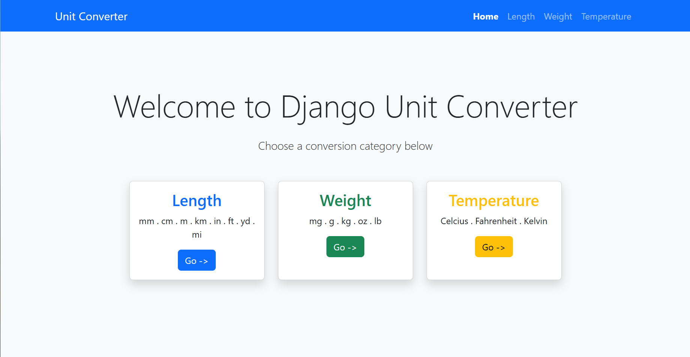
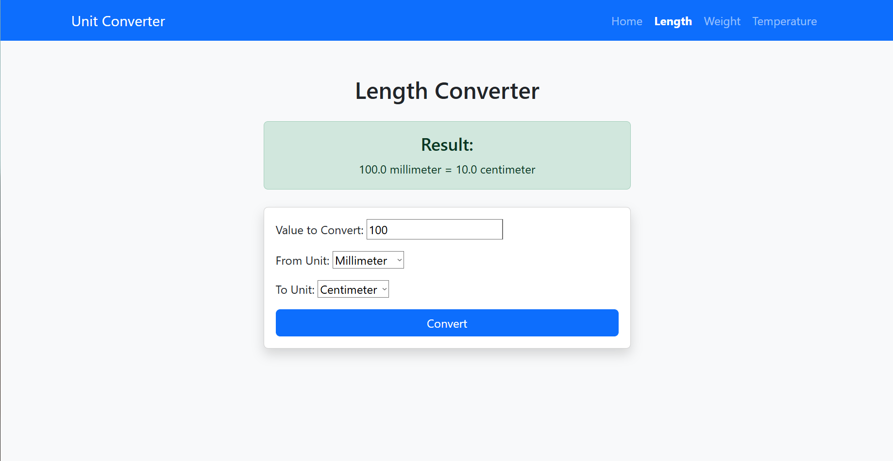
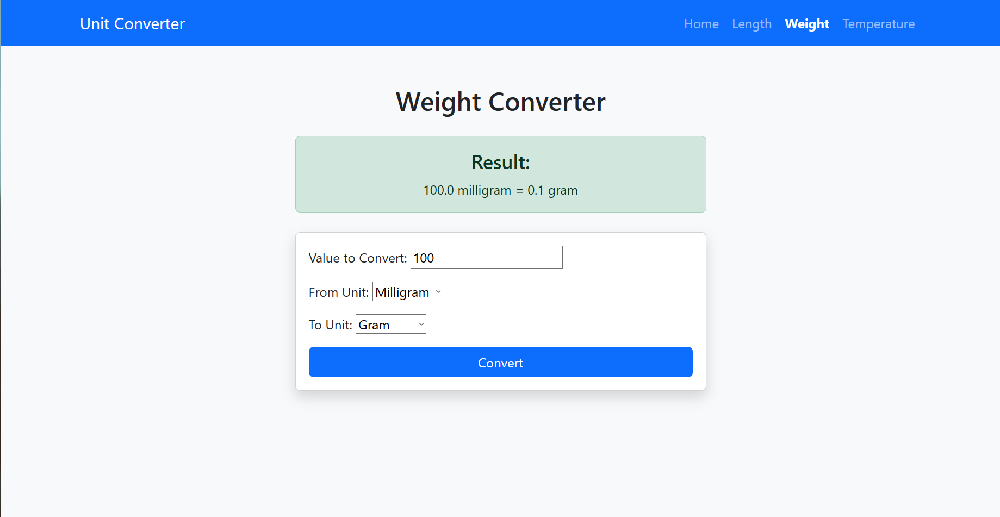
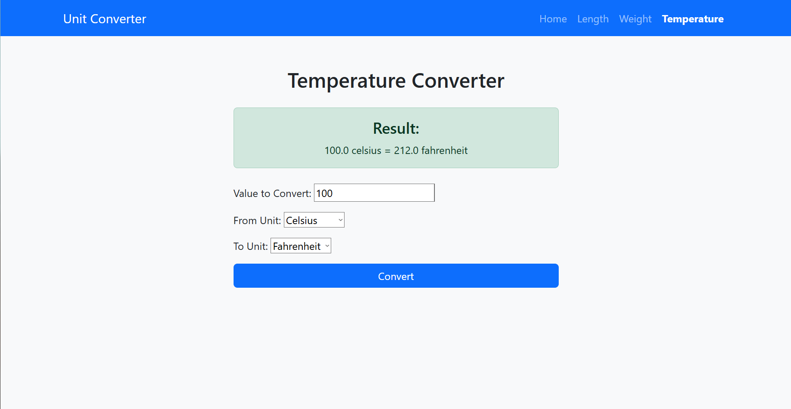

# Django Unit Converter

A simple unit conversion web app built with Django.

Supports conversion between units of length, weight, and temperature. No database used.

## Features

- Home page with links to converters
- Separate pages for:
  - Length (mm, cm, m, km, inch, foot, yard, mile)
  - Weight (mg, g, kg, oz, lb)
  - Temperature (Celsius, Fahrenheit, Kelvin)
- Form input with validation
- Results displayed on the same page after submission
- Responsive design using Bootstrap 5
- Clean URLs and active navigation

## Tech Stack

- Python
- Django
- Bootstrap 5 (via CDN)

## Setup and Run

```bash
git clone https://github.com/toestedbwead/django-unit-converter.git
cd django-unit-converter
python -m venv venv
source venv/bin/activate    # On Windows: venv\Scripts\activate
pip install django
python manage.py runserver
```

**Home Page**

**Length Page**

**Weight Page**

**Temperature Page**


this project is based on:
https://roadmap.sh/projects/unit-converter